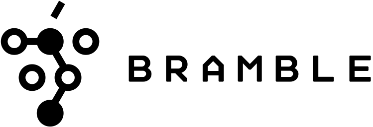

[](https://pkg.go.dev/github.com/movio/bramble)
[](https://goreportcard.com/report/github.com/movio/bramble)
[](https://codecov.io/gh/movio/bramble)

[**Full documentation**](https://movio.github.io/bramble)

Bramble is a production-ready GraphQL federation gateway.
It is built to be a simple, reliable and scalable way to aggregate GraphQL services together.


## Features

Bramble supports:

- Shared types across services
- Namespaces
- Field-level permissions
- Plugins:
  - JWT, CORS, ...
  - Or add your own
- Hot reloading of configuration

It is also stateless and scales very easily.

## Future work/not currently supported

There is currently no support for:
 
  - Subscriptions
  - Shared unions, interfaces, scalars, enums or inputs across services

Check FAQ for details: https://movio.github.io/bramble/#/federation?id=restriction-on-subscription

## Contributing

Contributions are always welcome!

If you wish to contribute please open a pull request. Please make sure to:

- include a brief description or link to the relevant issue
- (if applicable) add tests for the behaviour you're adding/modifying
- commit messages are descriptive

Before making a significant change we recommend opening an issue to discuss
the issue you're facing and the proposed solution.

### Building and testing

Prerequisite: Go 1.17 or newer

To build the `bramble` command:

```bash
go build -o bramble ./cmd/bramble
./bramble -conf config.json
```

To run the tests:

```bash
go test ./...
```

# Running locally

There is a [docker-compose](./docker-compose.yaml) file that will run bramble and three [example](./examples) services.

```
docker-compose up
```

The gateway will then be hosted on `http://localhost:8082/query`, be sure to point a GraphQL client to this address.

```graphql
{
  randomFoo {
    nodejs
    graphGophers
    gqlgen
  }
}
```

## Comparison with other projects

- [Apollo Server](https://www.apollographql.com/)

  While Apollo Server is a popular tool we felt is was not the right tool for us as:

  - the federation specification is more complex than necessary
  - it is written in NodeJS where we favour Go

- [Nautilus](https://github.com/nautilus/gateway)

  Nautilus provided a lot of inspiration for Bramble.

  Although the approach to federation was initially similar, Bramble now uses
  a different approach and supports for a few more things:
  fine-grained permissions, namespaces, easy plugin configuration,
  configuration hot-reloading...

  Bramble is also a central piece of software for [Movio](https://movio.co)
  products and thus is actively maintained and developed.
