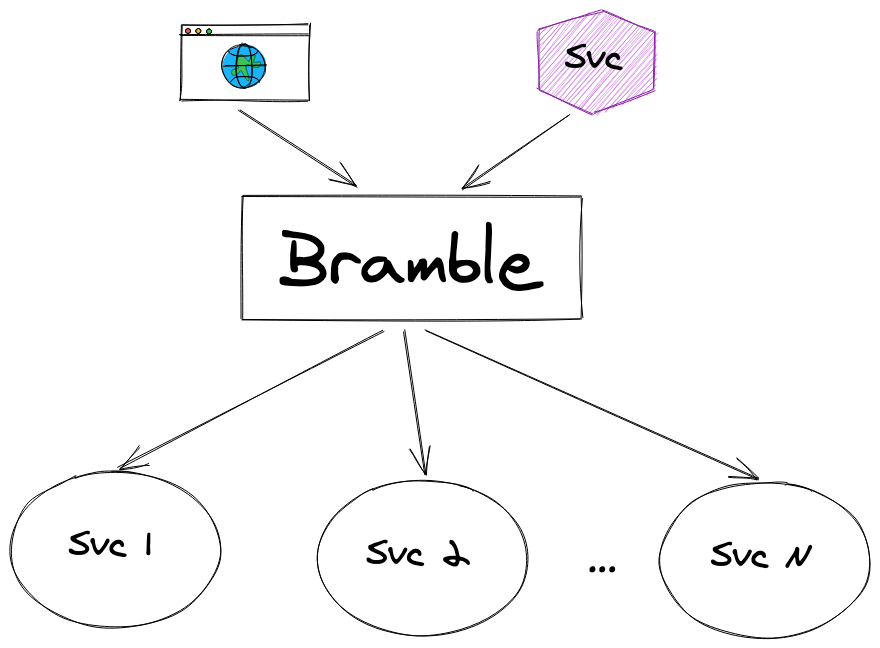

# Bramble

Bramble is a production-ready GraphQL federation gateway.
It is built to be a simple, reliable and scalable way to aggregate GraphQL services together.



## Features

Bramble supports:

- Shared types across services
- Namespaces
- Field-level permissions
- Plugins:
  - JWT, Open tracing, CORS, ...
  - Or add your own
- Hot reloading of configuration

It is also stateless and scales very easily.

## Future work/not currently supported

There is currently no support for subscriptions.

## Contributing

Contributions are always welcome!

If you wish to contribute please open a pull request. Please make sure to:

- include a brief description or link to the relevant issue
- (if applicable) add tests for the behaviour you're adding/modifying
- commit messages are descriptive

Before making a significant change we recommend opening an issue to discuss
the issue you're facing and the proposed solution.

### Building and testing

Prerequisite: Go 1.17 or newer

To build the `bramble` command:

```bash
go build -o bramble ./cmd
./bramble -config config.json
```

To run the tests:

```bash
go test ./...
```

## Comparison with other projects

Bramble provides a common-sense approach to GraphQL federation implemented in Golang. It assumes that subgraph fields are mutually exclusive, and that all boundary types join on a universal key. Compared with other projects:

- [Apollo Federation](https://www.apollographql.com/) and [Golang port](https://github.com/jensneuse/graphql-go-tools): while quite popular, we felt the Apollo spec was more complex than necessary with its nuanced GraphQL SDL and specialized `_entities` query, and thus not the right fit for us.

- [GraphQL Tools Stitching](https://www.graphql-tools.com/docs/schema-stitching/stitch-combining-schemas): while Stitching is similar in design to Bramble with self-contained subgraphs joined by basic queries, it offers more features than necessary at the cost of some performance overhead. It is also written in JavaScript where as we favour Golang.

- [Nautilus](https://github.com/nautilus/gateway): provided a lot of inspiration for Bramble, and has been improved upon with bug fixes and additional features (fine-grained permissions, namespaces, better plugins, configuration hot-reloading). Bramble is a recommended successor.

Bramble is a central piece of software for [Movio](https://movio.co) products and thus is actively maintained and developed.
