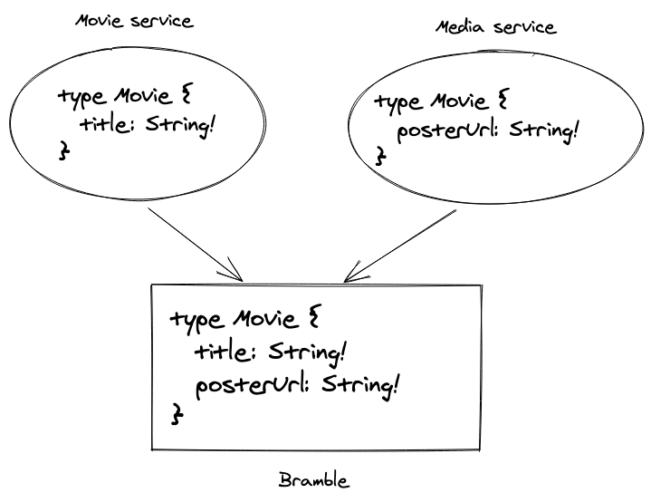
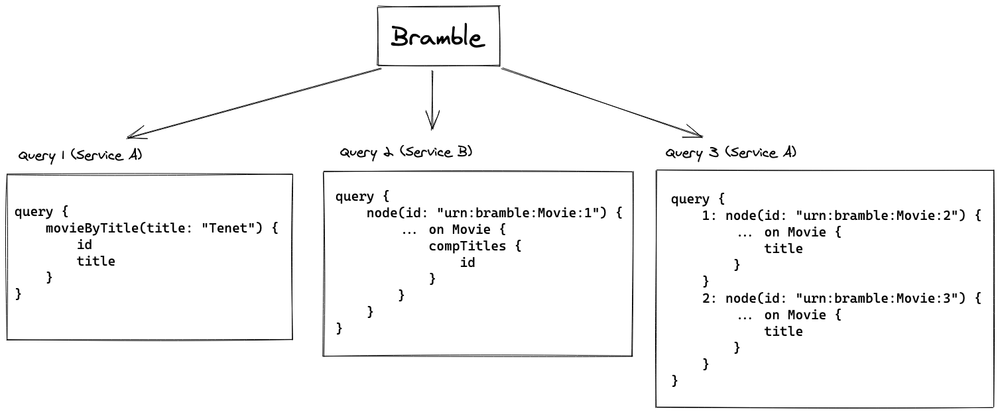

# Sharing types across services

Regular types cannot be shared across services, there are however two exceptions: boundary types and namespaces.

For more details, see the [federation specification](federation.md).

## Boundary types

### Introduction

A boundary type is a type shared by multiple services, where each service adds its own (non overlapping) fields to the type.

This is very useful when different services want to define different behaviours on a type.

For example we could have multiple services defining and enriching a `Movie` type:

```graphql
type Movie {
  title: String! # Defined in service A
  posterUrl: String! # Defined in service B
}

type Query {
  movieSearch(title: String!): [Movie!]
}
```

And the user transparently queries that type:

```graphql
query {
  movieSearch(title: "Source Code") {
    title
    posterUrl
  }
}
```



### Creating a boundary type

Here are the steps to make a type a boundary type:

1. **Add the `@boundary` directive**

```graphql
type Movie @boundary {
  title: String!
}
```

This tells Bramble that the type can be merged with others.

2. **Add and implement the `Node` interface**

```graphql
interface Node {
  id: ID!
}

type Movie implements Node @boundary {
  id: ID!
  title: String!
}
```

Boundary types need to share an ID across services so that they can be linked together and requested.
This ID should uniquely identify both the type and the object.

For example:

- Good IDs: `urn:bramble:Movie:1234`, `{"type": "Movie", "id": "1234"}`, `eyJ0eXBlIjogIk1vdmllIiwgImlkIjogIjEyMzQifQo=` (base64 encoded)
- Bad ID: `1234`

The ID format is free but should be consistent across your services.

3. **Add a `node` query**

```graphql
extend Query {
    node(id: ID!): Node
}
```

For Bramble to be able to request an arbitrary boundary object, every service defining boundary types must also implement a `node` query.
The `node` query takes a node id and returns the associated object.

For an example `node` query implementation see the [example services](examples.md).

?> **A note on boundary types and nullability**<br />
As with regular GraphQL types, a null response can sometimes have big
repercussions as a null value will bubble up to the first nullable field.<br/>
This is no different with boundary types, so when extending a boundary type
make sure fields are nullable if your service will sometimes return no
response for a given ID.

### How it works

When dealing with boundary types, Bramble will split the query into multiple steps:

1. Execute the root query
2. Execute `node` queries on the previous result
3. Merge the results

For example:

_Schema_

```graphql
type Movie {
  id: ID!
  title: String! # Defined in service A
  compTitles: [Movie!] # Defined in service B
}

type Query {
  movieSearch(title: String!): [Movie!]
}
```

_Query_

```graphql
query {
  movieSearch(title: "Tenet") {
    title
    compTitles {
      title
    }
  }
}
```

_Execution_



## Namespaces

A namespace is a type that can be shared among services for the purpose of... namespacing.

Namespaces types must respect the following rules:

- Use the `@namespace` directive
- End with `Query` or `Mutation` (e.g. `MyNamespaceQuery`)
- Can only be returned by a root field or another namespace.
- Have no arguments

### Example

_Service A_

```graphql
directive @namespace on OBJECT

type Query {
  myNamespace: MyNamespaceQuery!
}

type MyNamespaceQuery @namespace {
  serviceA: String!
}
```

_Service B_

```graphql
directive @namespace on OBJECT

type Query {
  myNamespace: MyNamespaceQuery!
}

type MyNamespaceQuery @namespace {
  serviceB: String!
}
```

_Merged Schema_

```graphql
type Query {
  myNamespace: MyNamespaceQuery!
}

type MyNamespaceQuery {
  serviceA: String!
  serviceB: String!
}
```
